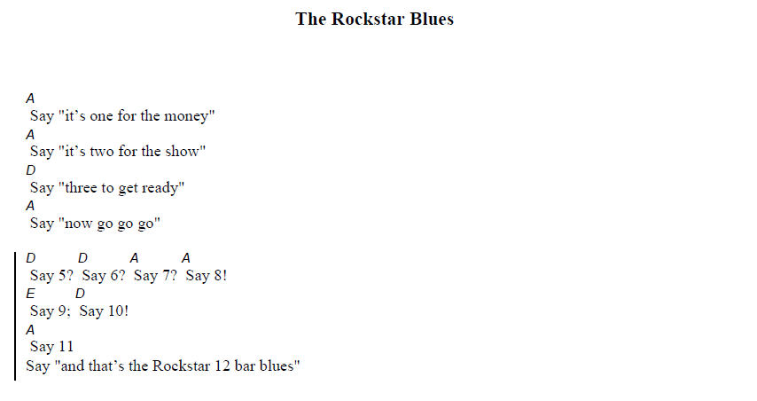

### "Hello, World"

"Hello World" in Rockstar looks like this:

```rockstar

```

Printing things isn't very rock‘n’roll, though. Rockers don't print, they `scream`, `shout`, or maybe just `say` things, so these are all valid aliases for `print`:

```rockstar

```

`print`  adds a newline to the end of the output. If you don't want this, use `write` or the alias `whisper`:

```rockstar

```

Almost everything in Rockstar is case-insensitive, and most whitespace is ignored:

```rockstar

```

Rockstar statements end with a newline, or with any of the punctuation characters `.?!;` 

```rockstar

```

## Comments

The use of comments in Rockstar programs is strongly discouraged. This is rock’n’roll; it’s up to the audience to find their own meaning. If you absolutely insist on commenting your Rockstar programs, comments should be contained in parentheses `()`. Yes, this means you can’t use brackets in arithmetic expressions and may need to decompose complex expressions into multiple evaluations and assignments.
### Line comments 

You can also use the `#` character to indicate a comment. Line comments last until the end of the line. 

> If any of you lot is actually unhinged enough to want to install Rockstar scripts on your machine and run them using the Unix hashbang `#!/bin/rockstar` syntax, I'm not going to stop you.

### ChordPro comments

Since Rockstar programs are song lyrics, it stands to reason you might want to include the chords for your programs, so aspiring rockstar developers can play along at home, so Rockstar will also allow comments to be surrounded by `{ }` and `[ ]`

```rockstar

```
Running this program through the ChordPro system produces this:

